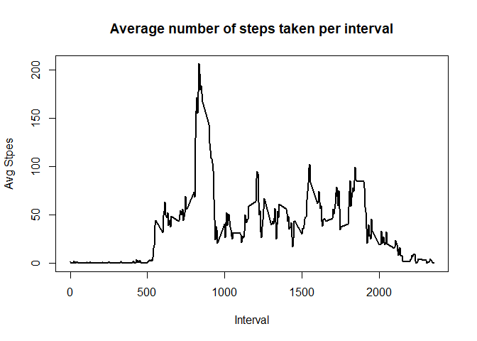
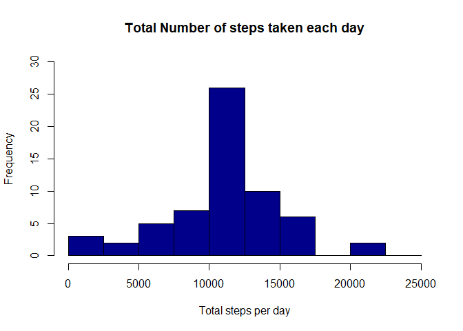
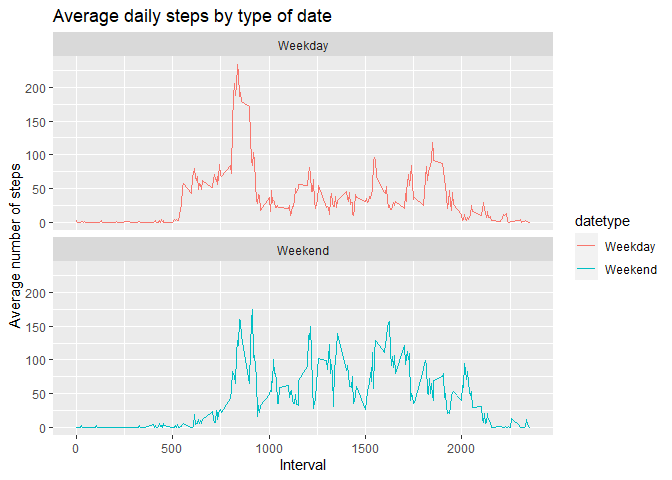

"Reproducible Research: Peer Assessment 1"
================================================================


## Loading the data and required packages into R


```r
library(ggplot2)

activity <- read.csv("activity.csv")
```

##Preprocessing the data


```r
activity$date <- as.POSIXct(activity$date, "%Y-%m-%d")
weekday <- weekdays(activity$date)
activity <- cbind(activity, weekday)
```

## What is mean total number of steps taken per day?


```r
activity_total_steps <- with(activity, aggregate(steps, by = list(date), FUN = sum, na.rm = TRUE))
names(activity_total_steps) <- c("date", "steps")
hist(activity_total_steps$steps, main = "Total number of steps taken per day", xlab = "Total steps taken per day", col = "darkblue", ylim = c(0,20), breaks = seq(0,25000, by=2500))
```

<!-- -->


```r
steps_mean <- mean(activity_total_steps$steps)
```

```r
steps_median <- median(activity_total_steps$steps)
```
*The mean of Total Number of steps take is 'r steps_mean'. *
*The median of Total Number of steps taken in 'r steps_median'. *

## What is the average daily activity pattern?


```r
average_daily_activity <- aggregate(activity$steps, by = list(activity$interval), FUN = mean, na.rm = TRUE)
names(average_daily_activity) <- c("interval", "mean")
plot(average_daily_activity$interval, average_daily_activity$mean, type = "l", lwd = 2, xlab = "Interval", ylab = "Avg Stpes", main = "Average number of steps taken per interval" )
```

<!-- -->


```r
steps_daily_average <- average_daily_activity[which.max(average_daily_activity$mean), ]$interval
```

*The 5 - min interval on avergae across all days in the dataset, with maximum steps is 'r steps_daily_average'. *

## Imputing missing values

The number of missing values are: 

```r
sum(is.na(activity$steps))
```

```
## [1] 2304
```

The missing values can be 


```r
imputed_steps <- average_daily_activity$mean[match(activity$interval, average_daily_activity$interval)]
```

Creating a new data set :

```r
activity_imputed <- transform(activity, steps = ifelse(is.na(activity$steps), yes = imputed_steps, no = activity$steps))
```

```r
total_steps_imputed <- aggregate(steps ~ date, activity_imputed, sum)
names(total_steps_imputed) <- c("date", "daily_steps")
```

```r
hist(total_steps_imputed$daily_steps, col = "darkblue", xlab = "Total steps per day", ylim = c(0,30), main = "Total Number of steps taken each day", breaks = seq(0,25000, by = 2500))
```

<!-- -->
Here is the mean of the total number of steps taken per day:

```r
mean(total_steps_imputed$daily_steps)
```

```
## [1] 10766.19
```
Here is the median of the total number of steps taken per day:

```r
median(total_steps_imputed$daily_steps)
```

```
## [1] 10766.19
```

## Are there differences in activity patterns between weekdays and weekends?

```r
activity$date <- as.Date(strptime(activity$date, format="%Y-%m-%d"))
activity$datetype <- sapply(activity$date, function(x) {
        if (weekdays(x) == "Saturday" | weekdays(x) =="Sunday") 
                {y <- "Weekend"} else 
                {y <- "Weekday"}
                y
        })
```

Plot for changes 


```r
activity_by_date <- aggregate(steps~interval + datetype, activity, mean, na.rm = TRUE)
plot<- ggplot(activity_by_date, aes(x = interval , y = steps, color = datetype)) +
       geom_line() +
       labs(title = "Average daily steps by type of date", x = "Interval", y = "Average number of steps") +
       facet_wrap(~datetype, ncol = 1, nrow=2)
print(plot)
```

<!-- -->

**Thank You **
